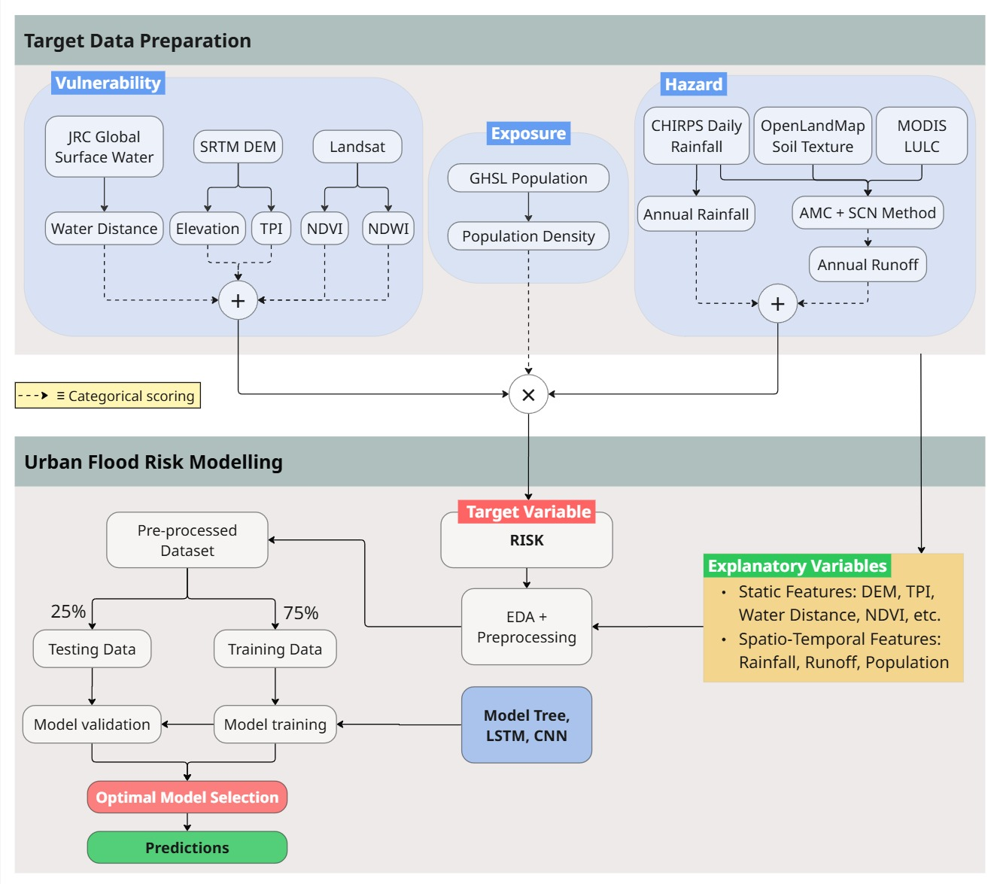

# Urban Flood Risk Prediction and Modeling

This project develops a **spatiotemporal flood risk prediction framework** for **100 Indian Smart Cities**, integrating geospatial, climatic, and socio-economic datasets using **Google Earth Engine (GEE)** and **Machine Learning (ML)** models.  

Flood risk is assessed through its three principal components — **Hazard**, **Vulnerability**, and **Exposure** — which are quantified, combined, and modelled to predict urban flood risk across space and time.

---

## 🧭 Project Overview

Urban flooding is an increasingly critical challenge in India due to rapid urbanization, changing rainfall patterns, and climate variability.

This project provides a **data-driven and scalable workflow** to estimate and model flood risk, enabling improved disaster preparedness and urban resilience planning.

The workflow follows a systematic pipeline:



## 🗺️ Interactive Visualization

An interactive flood risk visualization is available here:  
👉 [Smart City Flood Analysis Tool – GEE App](https://ee-smartcities56.projects.earthengine.app/view/smart-city-flood-analysis-tool)

This app allows users to visualize hazard, vulnerability, exposure, and total risk layers for each Indian smart city.

## 🛰️ Data Sources

| Component      | Dataset | Pixel Size / Resolution | Availability / Years | Frequency | Use |
|---------------|---------|-------------------------|----------------------|-----------|-----|
| **Vulnerability** | [JRC Global Surface Water v1.4](https://developers.google.com/earth-engine/datasets/catalog/JRC_GSW1_4_GlobalSurfaceWater) | 30 meters | 1984 – 2022 | - | Detecting permanent water bodies |
|               | [NASA SRTM 30m DEM](https://developers.google.com/earth-engine/datasets/catalog/USGS_SRTMGL1_003) | 30 meters | 2000 | One-time | Elevation / DEM data |
|               | [Landsat 8 C2 T1](https://developers.google.com/earth-engine/datasets/catalog/LANDSAT_LC08_C02_T1) | 30 meters | 2013 – present | 16-days | Land cover / Surface imagery |
| **Exposure**  | [GHSL Population P2023A](https://developers.google.com/earth-engine/datasets/catalog/JRC_GHSL_P2023A_GHS_POP) | 100 meters | 1975 – 2030 | 5-year | Population distribution |
| **Hazard**    | [OpenLandMap Soil Texture](https://developers.google.com/earth-engine/datasets/catalog/OpenLandMap_SOL_SOL_TEXTURE-CLASS_USDA-TT_M_v02) | 250 meters | 1950 – 2018 | - | Soil texture classification |
|               | [MODIS MCD12Q1 Land Cover](https://developers.google.com/earth-engine/datasets/catalog/MODIS_061_MCD12Q1) | 500 meters | 2001 – present | Annual | Land cover classification |
|               | [CHIRPS Daily Precipitation](https://developers.google.com/earth-engine/datasets/catalog/UCSB-CHG_CHIRPS_DAILY) | 5566 meters | 1981 – present | Daily | Daily precipitation |
|               | [TerraClimate Monthly Climate](https://developers.google.com/earth-engine/datasets/catalog/IDAHO_EPSCOR_TERRACLIMATE) | 4638.3 meters | 1958 – present | Monthly | Determining Precipitation & Runoff score thresholds |

## Usage
#### Install Python dependencies:
```bash
pip install -r requirements.txt
```
